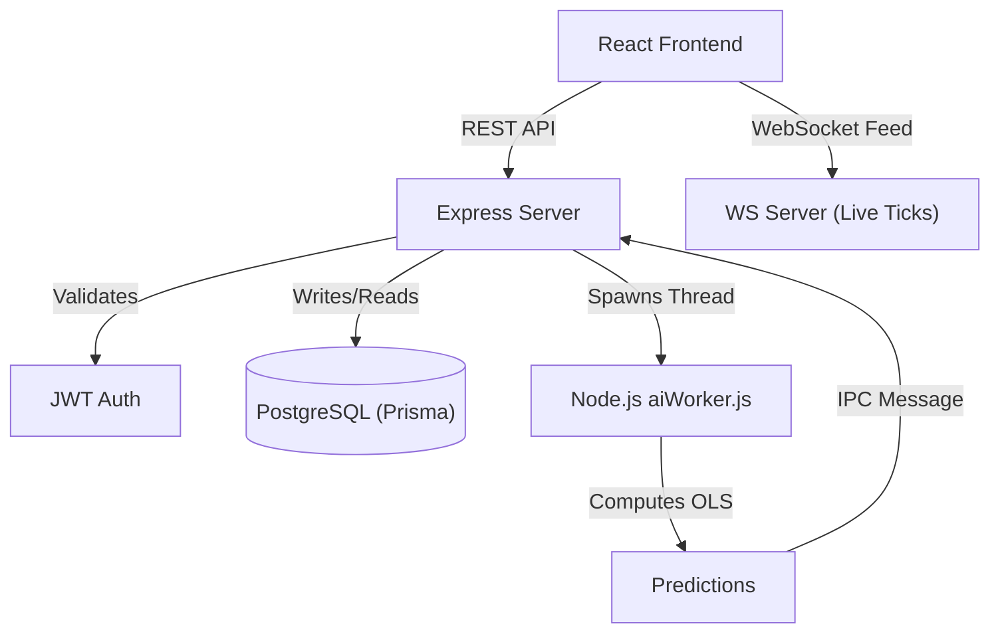

# 📈 Vishleshak: End-to-End System Report
## *Comprehensive Technical, Architectural, and Algorithmic Deep Dive*

This report documents the entire lifecycle of the Vishleshak platform in exhaustive detail, sequentially covering the underlying technologies, system architecture, raw mathematics, machine learning implementation, and the final prediction generation.

---

## 1. The Tech Stack & Ecosystem

Vishleshak is built on a high-performance, decoupled Javascript stack designed for institutional scale, prioritizing memory safety and non-blocking I/O.

### 1.1. Client-Side (Frontend)
*   **Core Framework**: React 19 + Vite. Chosen for immediate hot-module replacement and rapid client-side rendering. It utilizes React Hooks (`useState`, `useEffect`, `useRef`) for lifecycle management.
*   **Styling**: Tailwind CSS 4.0. Utility-first styling ensures a minimal CSS bundle. Custom animations (like `animate-pulse-soft`) are defined directly in `tailwind.config.js` for high-performance UI feedback.
*   **Charting Engine**: Lightweight Charts (TradingView). Unlike D3.js or Chart.js which manipulate the DOM, this engine renders pure HTML5 `<canvas>` elements, achieving 60 FPS during high-frequency intraday data streaming.
*   **Routing**: `react-router-dom` v6, implementing protected routes wrapped around a persistent `Sidebar` layout.

### 1.2. Server-Side (Backend)
*   **API Runtime**: Node.js + Express. Handles RESTful HTTP routing and middleware orchestration.
*   **Real-Time Engine**: Native WebSockets (`ws`). Maintains a persistent, bi-directional tunnel on Port 3005 for live ticker feeds.
*   **Machine Learning Core**: Node.js `worker_threads`. Spawns isolated V8 Javascript instances (`aiWorker.js`) to run heavy mathematical computations without blocking the Express event loop.
*   **Security & Auth**: `bcrypt` (Cost Factor 10) for password hashing and `jsonwebtoken` (JWT) for stateless session management.
*   **Data Parsing**: `multer` for multipart form data ingestion and `csv-parser` for stream-based line-by-line reading.

### 1.3. Database & ORM
*   **Database**: PostgreSQL hosted on Supabase, providing ACID-compliant transactional guarantees.
*   **ORM**: Prisma Client. Provides type-safe database queries and automated schema migrations.

---

## 2. System Flow & Architecture

The architecture explicitly separates IO-bound tasks (network, UI, WebSockets) from CPU-bound tasks (Machine Learning). 

### 2.1. The Ingestion Flow
1.  **User Trigger**: The analyst selects a dataset via `Upload.jsx` or triggers a synthetic prediction from `Prediction.jsx`.
2.  **API Gateway**: The request hits `/api/upload`. The Express server validates the JWT token in the `Authorization` header using the `authenticateToken` middleware.
3.  **Stream Parsing (Memory Safety)**: If a CSV is uploaded, it is never loaded entirely into RAM. It is piped through `multer` to a temporary disk location, then streamed via `csv-parser`.
    ```javascript
    fs.createReadStream(req.file.path)
        .pipe(csv())
        .on('data', (data) => results.push(data))
        .on('end', () => { /* dispatch to worker */ });
    ```
4.  **Worker Delegation**: The Express server isolates the dataset and spawns a new thread via `new Worker(path.join(__dirname, 'aiWorker.js'))`. The Express server immediately frees itself up to continue serving WebSocket ticks.

### 2.2. Architectural Diagram


---

## 3. The Mathematics

Before the code processes anything, the platform relies on foundational statistical mathematics to understand the market.

### 3.1. Ordinary Least Squares (OLS) Regression
To find the underlying trend in chaotic financial data, we use OLS Linear Regression. It seeks the line of best fit by minimizing the sum of the squares of the differences between the observed dependent variable and those predicted by the linear function.
$$y = mx + b$$
Where $y$ is the Price, and $x$ is Time.

To calculate the Slope ($m$) and Intercept ($b$), the system must compute the sums across all $n$ historical data points:
*   **Slope ($m$)**: Determines the trajectory angle.
    $$m = \frac{n(\sum xy) - (\sum x)(\sum y)}{n(\sum x^2) - (\sum x)^2}$$
*   **Intercept ($b$)**: Determines the baseline starting price.
    $$b = \frac{\sum y - m(\sum x)}{n}$$

### 3.2. Residual Variance (Standard Deviation)
A straight line doesn't represent real markets. To measure volatility, we calculate the Standard Deviation ($\sigma$) of the residuals (the difference between actual historical prices and the line of best fit):
$$\sigma = \sqrt{\frac{\sum(y_{actual} - y_{predicted})^2}{n}}$$

### 3.3. Simple Moving Average (SMA)
For the real-time dashboard, the system calculates a rolling SMA to overlay on the live ticks, smoothing out short-term fluctuations:
$$SMA_n = \frac{1}{n} \sum_{i=1}^{n} P_i$$

---

## 4. Machine Learning (ML) Implementation

Here is exactly how the raw mathematics are translated into the Node.js `aiWorker.js` engine.

### 4.1. Heuristic Feature Extraction
Financial datasets are messy. Before training, the worker attempts to find the "Price" feature by dynamically scanning the CSV column headers. It handles case-insensitivity and multiple standard naming conventions.
```javascript
const targetKeys = ['close', 'price', 'last', 'value', 'settle', 'adj close'];
for (const key of keys) {
    if (targetKeys.includes(key.toLowerCase())) {
        return row[key];
    }
}
```

### 4.2. Model Calibration (Training Phase)
The `StatisticalForecaster` class ingests the normalized array of prices. In a single, highly-optimized `O(N)` loop, it computes the mathematical sums:
```javascript
let sumX = 0, sumY = 0, sumXY = 0, sumXX = 0;
for (let i = 0; i < n; i++) {
    sumX += i;
    sumY += this.data[i];
    sumXY += i * this.data[i];
    sumXX += i * i;
}
```
Using these sums, it calculates `this.slope` and `this.intercept`.

### 4.3. Volatility Profiling
It then runs a second loop over the historical data to calculate the Standard Deviation (`this.stdDev`). It computes the expected `prediction` for day $i$ and sums the squared difference from the actual `data[i]`.

---

## 5. The Actual Prediction Process

Once the model is calibrated and the historical volatility is profiled, the system generates the future forecast.

### 5.1. The Projection Loop
The worker initiates a loop for the requested number of future days (e.g., 30 steps into the future).
For each future day, it calculates the baseline trend trajectory:
```javascript
const trendValue = this.slope * timeIdx + this.intercept;
```

### 5.2. Stochastic Noise Injection
To make the forecast realistic and account for market volatility, the worker injects Stochastic Noise. It generates a random float between -1 and 1, scales it by the asset's historical Standard Deviation, and halves it for algorithmic smoothness:
```javascript
const noise = (Math.random() * 2 - 1) * this.stdDev * 0.5;
const finalValue = trendValue + noise;
```

### 5.3. Final Payload Assembly & Delivery
1.  **Array Assembly**: The `finalValue` for each day is formatted to 2 decimal places and pushed into a `predictions` array along with an estimated confidence score.
2.  **IPC Handoff**: The worker thread sends the array back to the Express server using Node's Inter-Process Communication (IPC):
    ```javascript
    parentPort.postMessage({ status: 'complete', predictions });
    ```
3.  **Audit Logging**: The Express server catches the message and immediately saves an execution audit log to PostgreSQL (via Prisma), recording the `rowsProcessed` and the final `prediction` value.
4.  **Client Delivery**: The Express server sends the JSON array back to the React frontend.
5.  **Rendering**: The React `Prediction.jsx` and `LiveChart.jsx` components ingest the new data series, recalculate the canvas boundaries, and render the high-fidelity predictive trendline.

---

## 6. Real-Time Engine & Live Dashboard

While the ML Worker handles historical predictions, the Express server concurrently runs a live ticker engine for the Intraday Dashboard.

### 6.1. Tick Generation
The server utilizes a `setInterval` function running every 1.5 seconds to generate a new market tick (`generateTick()`).
*   **Volatility Bounds**: The price undergoes a bounded random walk, restricted to a maximum `0.2%` change per tick (`volatility = 0.002`).
*   **OHLC Construction**: It computes `Open`, `Close`, `High`, and `Low` values based on the random walk to format a standard candlestick.

### 6.2. SMA & Broadcasting
A rolling history array of the last 20 ticks (`priceHistory`) is maintained in memory. The system calculates the Simple Moving Average (SMA) and attaches it to the tick payload.
```javascript
const dataString = JSON.stringify(tick);
wss.clients.forEach(client => {
    if (client.readyState === WebSocket.OPEN) {
        client.send(dataString);
    }
});
```
The React frontend receives this payload and injects it into the Lightweight Charts instance, utilizing a strict 50ms throttle (`now - lastUpdateRef.current < 50`) to guarantee the UI does not freeze during high-frequency broadcasts.
