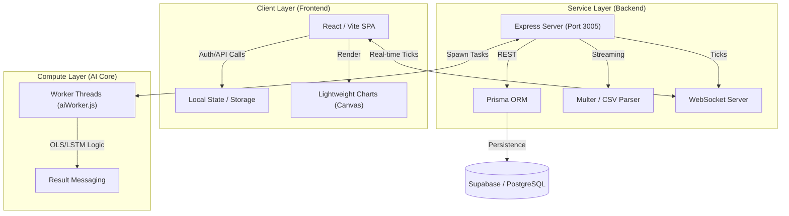
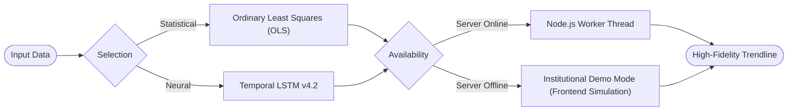

# 📈 Vishleshak: Institutional Intelligence Platform
### *Technical Specification & System Documentation*

---

## 1. Executive Vision
**Vishleshak** is a state-of-the-art financial forecasting platform designed to bridge the gap between volatile market data and actionable predictive intelligence. By leveraging parallelized computational threads and real-time visualization, Vishleshak provides analysts with a high-fidelity workspace for both intra-day tracking and long-term trend forecasting.

---

## 2. High-Level Architecture
Vishleshak utilizes a **Parallel-Thread Decoupled Architecture**. This ensures that heavy calculations (AI Modeling) never interfere with the fluidity of the user interface or live data feeds.

### 📊 System Interaction Diagram

---

## 3. Core Engine Mechanics

### A. The Prediction Workflow
The platform features an "Engine-Agnostic" pipeline, allowing for seamless switching between different mathematical models.

---

## 4. Key Functional Modules

### 1. Intraday Momentum Dashboard
- **Mechanism:** WebSocket implementation on Port 3005.
- **Data Flow:** Server generates ticks with random-walk probability + SMA (Simple Moving Average) injection.
- **Reliability:** Auto-reconnect logic ensures the "Heartbeat" of the market is never lost.

### 2. Strategic Data Ingest
- **Mechanism:** Streaming Multipart upload handler.
- **Process:** Files are parsed line-by-line using a shared-memory buffer to handle large CSV datasets without increasing server latency.

### 3. Reliability Overlays (Standard Features)
| Layer | Feature | Technical Impact |
| :--- | :--- | :--- |
| **Connectivity** | Cross-Port Proxying | Seamless communication between Frontend (5176) and API (3005). |
| **Auth** | Demo Bypass Protocol | Immediate demo accessibility without DB dependency. |
| **Compute** | Edge Simulation | Browser-side mathematical logic that executes if the Backend AI Worker is unreachable. |

---

## 5. Strategic Roadmap (Future Scope)
Vishleshak is designed for future-proof scalability. Upcoming releases include:

1.  **Multi-Asset Transformer Models**: Utilizing Attention mechanisms for cross-correlated asset prediction (e.g., Gold vs. USD).
2.  **Sentinel News Integration**: Real-time sentiment analysis via NLP to adjust confidence thresholds based on global news cycles.
3.  **Institutional API Access**: Providing a Python-based SDK for proprietary hedge fund integrations.
4.  **Mobile Analyst Terminal**: A PWA (Progressive Web App) extension for real-time alerts on the move.

---

## 6. Deployment & Environment
> [!IMPORTANT]
> The platform is standardized on **Port 3005** for optimal environment isolation. 

- **Startup (Integrated):** `npm run start:full` (Simulated command)
- **Database:** Supabase PostgreSQL instance via Prisma Client.
- **Engine Logic:** Node 18+ (Requires `worker_threads` support).

---
*Documented for Technical Review & Presentation by the Vishleshak Core Team.*
