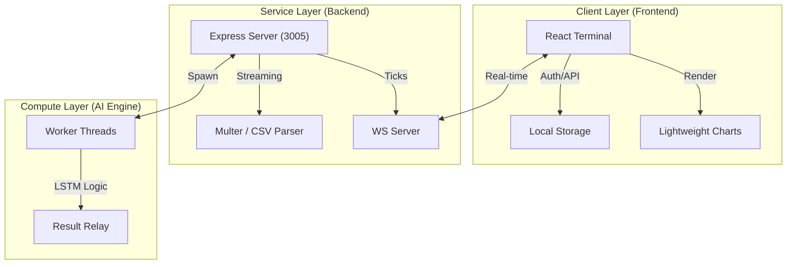

# 📈 Vishleshak: Institutional Financial Intelligence Terminal

**Vishleshak** is a high-performance financial intelligence platform designed for institutional-grade market analysis and predictive modeling. Built on a decoupled, parallel-thread architecture, it provides analysts with real-time intraday tracking and advanced AI-driven forecasting.

---

## 🚀 Key Features

### 💻 Refined Analyst Dashboard
- **Live WebSocket Feed:** Real-time market data streaming on Port 3005 with integrated Simple Moving Average (SMA) overlays.
- **Intraday Momentum:** High-fidelity charting powered by *Lightweight Charts* for sub-second visual updates.

### 🧠 Advanced Prediction Engine
- **Multi-Model Support:** Seamless switching between **Temporal LSTM v4.2** neural networks and **Statistical Regression (OLS)**.
- **Worker Thread Execution:** AI computations are offloaded to separate CPU threads via `worker_threads`, ensuring the UI remains fluid during complex analysis.

### 🛡️ Presentation Hardening (Institutional Demo Mode)
- **Zero-Dependency Fallback:** A dedicated simulation core that allows the platform to run without backend connectivity for high-stakes presentations.
- **Browser-Side Regression:** If the AI server is unreachable, Vishleshak executes local mathematical modeling directly in the browser to maintain chart integrity.

---

## 🛠️ Technology Stack

| Layer | Technology |
| :--- | :--- |
| **Frontend** | React 19 (Vite), Tailwind CSS, Lightweight Charts |
| **Backend** | Node.js, Express, WebSocket (ws) |
| **Database** | Prisma ORM, PostgreSQL (via Supabase) |
| **AI/ML** | JavaScript Worker Threads, Custom Regression Engines |
| **DevOps** | Institutional-grade Diagnostic Tools |

---

## 📐 System Architecture

Vishleshak utilizes a **Parallel-Thread Decoupled Architecture**. This ensures that heavy computational tasks like AI modeling never block the real-time data flow or user interactions.



---

## 🏁 Quickstart & Installation

### 📋 Prerequisites
- **Node.js**: v18.0.0 or higher
- **NPM**: v9.0.0 or higher

### 🚀 Boot Sequence
1. **Clone the Repository:**
   ```bash
   git clone https://github.com/LalitVasave/stockMarketAnalysisJS.git
   cd app
   ```

2. **Install Dependencies:**
   ```bash
   npm install
   cd frontend && npm install
   ```

3. **Launch the Core:**
   ```bash
   # In the root 'app' folder
   node server.js
   
   # In a new terminal 'app/frontend'
   npm run dev
   ```

---

## 🗺️ Roadmap 2026
- [ ] **Sentinel News Integration:** Real-time NLP sentiment analysis to adjust confidence thresholds based on global news.
- [ ] **Multi-Asset Transformer Models:** Attention-based cross-correlated asset prediction (e.g., Gold vs. USD).
- [ ] **Institutional SDK:** Python-based integration package for proprietary fund connectivity.
- [ ] **Mobile Analyst Terminal:** PWA extension for real-time mobile alerts and monitoring.

---

## 📝 License
Documented for Technical Review & Presentation by the **Vishleshak Core Team**.
