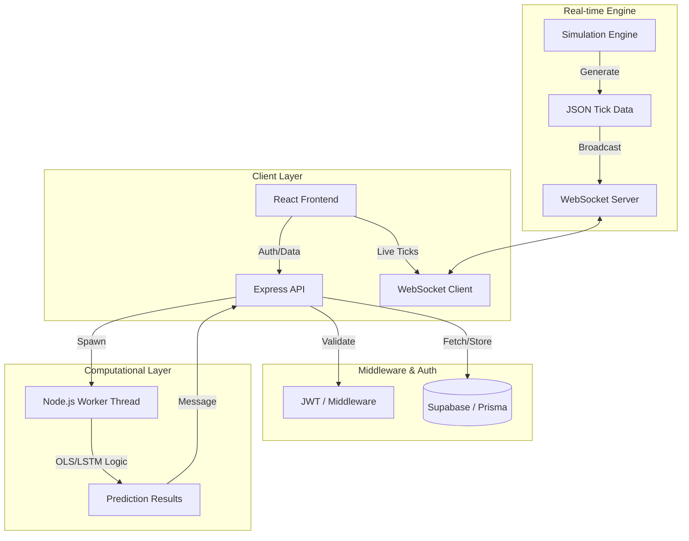

# 📈 Vishleshak: System Architecture & Mathematical Dossier
### *Institutional Intelligence Platform - Technical Whitepaper*

---

## 1. Executive Summary
**Vishleshak** is a high-fidelity financial analytics platform designed for institutional-grade market forecasting. It bridges the gap between raw market data and actionable predictive intelligence by leveraging a **Parallel-Thread Decoupled Architecture**. The platform provides real-time intraday tracking via WebSockets and long-term trend forecasting using high-performance worker threads, ensuring zero latency in the user interface during heavy computational loads.

---

## 2. Technology Stack Specification

| Layer | Component | Description |
| :--- | :--- | :--- |
| **Frontend** | React 18+ / Vite | High-speed Single Page Application (SPA). |
| **Visualization** | Lightweight Charts | Financial charting library by TradingView. |
| **Backend** | Node.js / Express | REST API and WebSocket orchestration. |
| **Compute Core** | Worker Threads | Decoupled AI/Math processing (aiWorker.js). |
| **Database** | Supabase (PostgreSQL) | Secure persistence for user data and uploads. |
| **ORM** | Prisma | Type-safe database management and migrations. |
| **Security** | JWT & Bcrypt | Industry-standard authentication and hashing. |

---

## 3. System Architecture

Vishleshak utilizes a decoupled approach to ensure that "Compute-Hungry" tasks do not block the "IO-Intensive" UI updates.

---

## 4. Mathematical Foundations

The platform's analytical power is derived from three primary mathematical domains.

### A. Trend Forecasting: Ordinary Least Squares (OLS)
The core forecasting model uses Linear Regression to find the relationship between time ($x$) and price ($y$).

**The Linear Model:**
$$y = mx + b$$

**Slope Calculation ($m$):**
Determines the trend trajectory.
$$m = \frac{n(\sum xy) - (\sum x)(\sum y)}{n(\sum x^2) - (\sum x)^2}$$

**Intercept Calculation ($b$):**
Determines the baseline starting price.
$$b = \frac{\sum y - m(\sum x)}{n}$$

**Residual Analysis (Reliability):**
The model calculates the Standard Deviation ($\sigma$) of the "residuals" (difference between actual and predicted points) to determine forecast confidence.
$$\sigma = \sqrt{\frac{\sum(y_{actual} - y_{predicted})^2}{n}}$$

### B. Technical Indicators: Simple Moving Average (SMA)
Used to filter out market noise and identify the underlying price momentum.
$$SMA_n = \frac{1}{n} \sum_{i=1}^{n} P_i$$

### C. Live Simulation: Random Walk Theory
The real-time dashboard uses a stochastic process with volatility control to simulate realistic market behavior.
$$P_{t} = P_{t-1} \times (1 + \text{Change})$$
$$\text{Change} \in [-\text{Volatility}, +\text{Volatility}]$$

---

## 5. Core Operational Workflows

### 1. The Prediction Pipeline
1.  **Request**: User selects an asset and timeframe.
2.  **Dataset Preparation**: Backend generates a synthetic 60-day historical window.
3.  **Handoff**: Data is sent to `aiWorker.js` via `worker_threads`.
4.  **Calibrate**: The worker thread performs OLS training.
5.  **Project**: The worker projects future prices with injected stochastic noise.
6.  **Response**: Frontend renders the forecast as a high-fidelity trendline.

### 2. Strategic Data Ingest
*   **Mechanism**: Streaming Multipart upload handler using `Multer`.
*   **CSV Parsing**: Files are parsed line-by-line using `csv-parser`.
*   **Auto-Mapping**: The system dynamically maps columns like "Close", "Price", or "Settle" to ensure compatibility with various financial data providers.

---

## 6. Security & Data Integrity
*   **Authentication**: Multi-tier security using JWT tokens for all analytical endpoints.
*   **Persistence**: Historical uploads are stored with metadata (rows processed, predicted delta) in Supabase.
*   **Isolation**: Worker threads ensure that a logical error in the math model cannot crash the main analytical server.

---

## 7. Strategic Roadmap
1.  **Temporal LSTM v5**: Moving from linear statistical models to deep-learning neural networks.
2.  **Sentiment Overlay**: Integrating NLP (Natural Language Processing) to factor in global news cycles.
3.  **Proprietary Hedge Fund API**: A Python-based SDK for direct institutional integration.

---
*Documented by the Vishleshak Core Engineering Team.*
